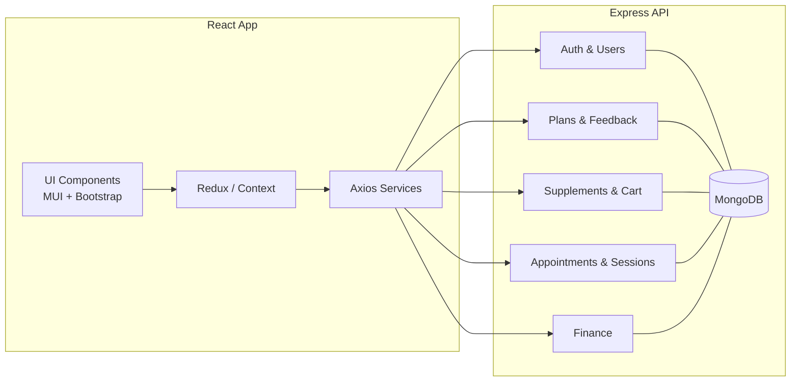

<div align="center">
  <h1>Maxxie Fitness Center Management System</h1>
  <p><strong>Full‑stack platform for members, coaches, and admins</strong></p>

  <p>
    <a href="https://nodejs.org" target="_blank"></a>
    <a href="https://expressjs.com" target="_blank"></a>
    <a href="https://react.dev" target="_blank"></a>
    <a href="https://www.mongodb.com" target="_blank"></a>
    <a href="LICENSE" target="_blank"></a>
  </p>

  <!-- Project demo: Put your video at docs/demo.mp4 for GitHub to render a player below -->
  <video src="docs/demo.mp4" controls style="max-width: 980px; width: 100%; border-radius: 12px; box-shadow: 0 10px 30px rgba(2,6,23,.18);"></video>
  <p><em>If the video does not load, add your project demo at <code>docs/demo.mp4</code> or replace the source with a hosted URL.</em></p>
</div>

---

### Overview

Maxxie is a full‑stack web application that streamlines fitness center operations — member registration, appointments, personalized workout and diet plans, supplement store with cart/checkout UI, payments and expenses tracking, and rich admin tooling.

Key goals:

- Consistent member experience across plans, sessions, and feedback
- Efficient admin workflows for inventory, sessions, plans, and finance
- Secure API with JWT, robust validation, and media uploads

---

### Monorepo Layout

```
.
├── backend/           # Express + MongoDB API, uploads, auth, plans, sessions, finance
└── frontend/          # React app (CRA), MUI + Bootstrap UI, charts, reports
```

---

### Features

- General
  - Authentication with roles (member, admin)
  - Responsive UI for desktop/mobile
  - Profile and password reset
- Member
  - Membership plan management
  - Book/edit/cancel appointments (PT, group, yoga, crossfit)
  - Assigned workout and diet plans with feedback
  - Supplement store with cart and order confirmation
  - Payment history (UI)
- Admin
  - Manage users/roles, membership plans, appointments
  - CRUD workout and diet plans, feedback review
  - Supplement inventory and analytics
  - Record and fetch payments/expenses

---

### Tech Stack

- Frontend: React, React Router, Redux, Axios, MUI, Bootstrap, Chart.js, jsPDF
- Backend: Node.js, Express.js, MongoDB, Mongoose, JWT, Multer, bcrypt, dotenv
- Utilities: Nodemailer, Recharts, html2canvas

---

### Quick Start

Requirements:

- Node.js 16+ (18+ recommended)
- npm
- MongoDB (local or Atlas)

1) Backend

```
cd backend
npm install
cp .env.example .env  # If you have a template; otherwise create .env as below
npm run dev           # or: npm start (runs on PORT or 5000)
```

2) Frontend

```
cd frontend
npm install
npm start             # CRA dev server on http://localhost:3000
```

Default dev ports:

- API server: http://localhost:5000 (CORS allows http://localhost:3000 and http://localhost:3001)
- Frontend: http://localhost:3000

---

### Environment Variables (Backend)

Create `backend/.env` with at least:

```
NODE_ENV=development
PORT=5000
MONGO_URI=mongodb://localhost:27017/maxxie
JWT_SECRET=your_super_secret_jwt_key
```

Notes:

- The running server uses `MONGO_URI` (see `backend/server.js`).
- If you use a separate connector (`backend/config/db.js`) it expects `MONGO_URL`. Prefer `MONGO_URI` to match the active server.

---

### Scripts

- Backend
  - `npm run dev` — start Express with nodemon
  - `npm start` — start Express once
- Frontend
  - `npm start` — start CRA dev server
  - `npm run build` — production build
  - `npm run deploy` — deploy to GitHub Pages (configured via `homepage`)

---

### Core API Endpoints

Base URL: `http://localhost:5000`

- Auth & Users: `POST /user/login`, `POST /user/register`, `GET /user/profile` (token)
- Workout Plans: `GET/POST /api/workout-plans`
- Diet Plans: `GET/POST /api/diet-plans`
- Membership Plans: `GET/POST /api/membership-plans`
- Supplements: `GET/POST /api/supplements`
- Admin: `GET/POST /api/admin`
- Workout Feedback: `GET/POST /api/workout-feedback`
- Diet Feedback: `GET/POST /api/diet-feedback`
- Appointments: `GET/POST /api/appointment`
- Sessions: `GET/POST /api/sessions`
- Finance: `GET/POST /finance`

Uploads: Static files are served from `/uploads`.

---

### Architecture



---

### Demo & Media

- Add additional screenshots/GIFs in a `docs/` folder and reference them here.

---

### Contributing

1. Fork and clone the repo
2. Create a feature branch: `git checkout -b feat/your-feature`
3. Commit changes: `git commit -m "feat: add your feature"`
4. Push and open a Pull Request

Please keep code readable, typed where applicable, and follow existing patterns for routes, models, and components.

---

### License

This project is licensed under the MIT License. See `LICENSE` for details.

---

### Reference

- Repository: [Maxxie_Fitness_Management_System on GitHub](https://github.com/Saumya-Us/Maxxie_Fitness_Management_System)
